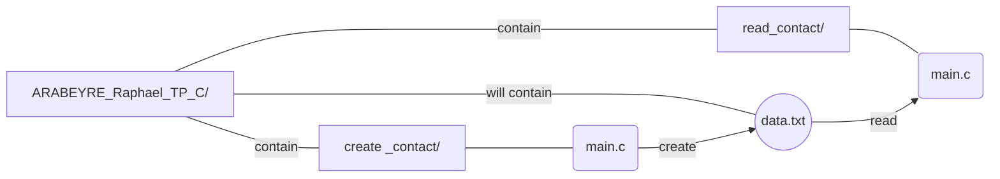

# Command to do :

```bash
 cd create_contact
```
compile ```main.c```
execute then.

```bash
 cd ../read_contact
```
compile ```main.c```
execute then.


#


```mermaid
graph LR
main[ARABEYRE_Raphael_TP_C/ ]
main -- contain --- cc[create _contact/ ]
main -- contain --- rc[read_contact/ ]
main -- will contain  --- d


cc --- mcc(main.c)
rc --- mrc(main.c)

mcc -- create --> d((data.txt))
d -- read --> mrc 
```
